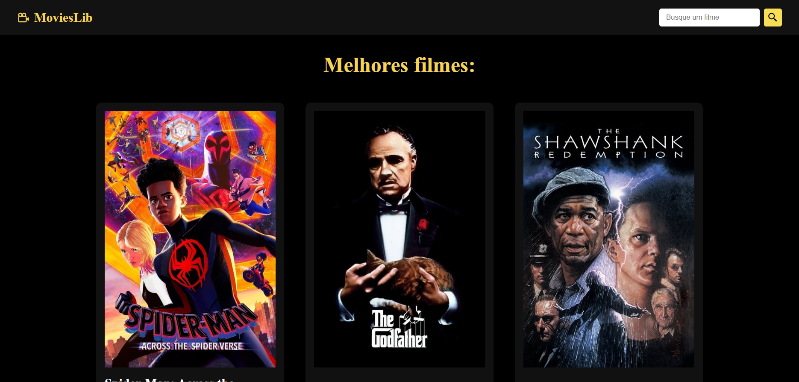

# Pokedex

## Table of contents

- [Overview](#overview)
  - [Features](#features)
  - [Preview](#preview)
  - [Demo](#demo)
- [Process](#process)
  - [Built with](#built-with)
- [Author](#author)

## :mega: Overview

A project to my portfolio made based on API from [themoviedb](https://www.themoviedb.org). See more below :)

### Features

- Search movies
- Details pages about any movie
- Responsiveness

### Preview

### Demo

[Click here to see more](https://movies-library-rh.netlify.app)

## :newspaper: Process

- Consumption of Api from [themoviedb](https://www.themoviedb.org)

### Built with

- [Javascript](https://developer.mozilla.org/pt-BR/docs/Web/JavaScript)
- [React.Js](https://reactjs.org)
- React Hooks

### :man: Author

<table>
  <tr>
    <td align="center">
          
         <a href="https://github.com/ruanHeleno"> <b>Ruan Heleno</b> </a> 
    </td>
  </tr>
</table>

- [Portfolio](https://ruanheleno.github.io)
- [LinkedIn](https://www.linkedin.com/in/ruanheleno/)
